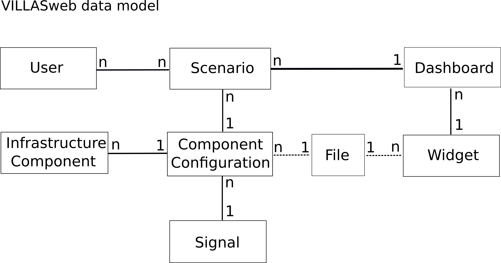

#  VILLASweb

This is VILLASweb, the website to configure real-time co-simulations and display simulation real-time data in the web browser.
The term **frontend** refers to this project, the actual website.
The frontend connects to **two** backends: [VILLASweb-backend-go](https://git.rwth-aachen.de/acs/public/villas/web-backend-go) and [VILLASnode](https://git.rwth-aachen.de/acs/public/villas/node).
VILLASnode provides actual simulation data via websockets. VILLASweb-backend-go provides any other data such as user accounts, infrastructure components and configurations, dashboards etc.
For more information on the backends see their repositories.

## Frameworks
The frontend is build upon [ReactJS](https://facebook.github.io/react/) and [Flux](https://facebook.github.io/flux/).
React is responsible for rendering the UI and Flux for handling the data and communication with the backends. For more information also have a look at REACT.md
Additional libraries are used, for a complete list see the file `package.json`.

## Data model


## Quick start
```bash
$ git clone --recursive https://git.rwth-aachen.de/acs/public/villas/web.git
$ cd web
$ npm install
$ npm start
```
We recommend to start the VILLASweb-backend-go before the frontend.
If you want to use test data (including some test users), you can start the backend with the parameter `-mode=test`.
Please check the repository of the VILLASweb-backend-go to find information on the test user login names and passwords.
The testing mode is NOT intended for production deployments.

## Documentation

More details on the setup and usage of VILLASweb is available here:
- [Requirements](doc/Requirements.md)
- [Structure and datamodel](doc/Structure.md)
- [Development setup](doc/development.md)
- [Production setup](doc/Production.md)

## Copyright

2020, Institute for Automation of Complex Power Systems, EONERC  

## License

This project is released under the terms of the [GPL version 3](COPYING.md).

We kindly ask all academic publications employing components of VILLASframework to cite one of the following papers:

- A. Monti et al., "[A Global Real-Time Superlab: Enabling High Penetration of Power Electronics in the Electric Grid](https://ieeexplore.ieee.org/document/8458285/)," in IEEE Power Electronics Magazine, vol. 5, no. 3, pp. 35-44, Sept. 2018.
- S. Vogel, M. Mirz, L. Razik and A. Monti, "[An open solution for next-generation real-time power system simulation](http://ieeexplore.ieee.org/stamp/stamp.jsp?tp=&arnumber=8245739&isnumber=8244404)," 2017 IEEE Conference on Energy Internet and Energy System Integration (EI2), Beijing, 2017, pp. 1-6.

```
This program is free software: you can redistribute it and/or modify
it under the terms of the GNU General Public License as published by
the Free Software Foundation, either version 3 of the License, or
any later version.

This program is distributed in the hope that it will be useful,
but WITHOUT ANY WARRANTY; without even the implied warranty of
MERCHANTABILITY or FITNESS FOR A PARTICULAR PURPOSE.  See the
GNU General Public License for more details.

You should have received a copy of the GNU General Public License
along with this program.  If not, see <http://www.gnu.org/licenses/>.
```

For other licensing options please consult [Prof. Antonello Monti](mailto:amonti@eonerc.rwth-aachen.de).

## Contact

[](http://www.acs.eonerc.rwth-aachen.de)

 - Steffen Vogel <stvogel@eonerc.rwth-aachen.de>
 - Sonja Happ <sonja.happ@eonerc.rwth-aachen.de>

[Institute for Automation of Complex Power Systems (ACS)](http://www.acs.eonerc.rwth-aachen.de)  
[EON Energy Research Center (EONERC)](http://www.eonerc.rwth-aachen.de)  
[RWTH University Aachen, Germany](http://www.rwth-aachen.de)  
